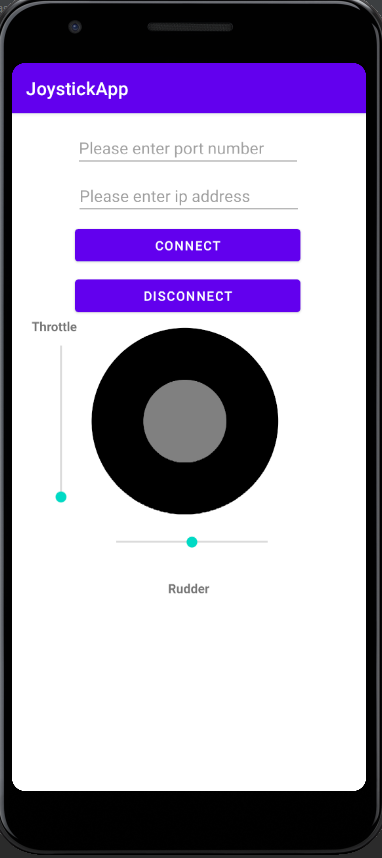

# JoystickMobileApp

### Summary
We developed an Android app which allows the user to fly an airplane through the FlightGear simulator. The application implements a TCP client which sends data to the FlightGear simulator server.
We actually send data about the ailero,elavator, rudder,throttle. The app has a seekBar for the throttle, and another one for the rudder, and also has a joystick for changing the aileron and elevator. 
During the project we implement the MVVM architecture, and used a ForkJoinPool with one thread.

### App Features
- [x] Change the flight speed as desired (the throttle seekBar)
- [x] Joystick animation that allows the user to change the elevator and aileron. 

### Folder Structure

### Required installations
* FlightFear 2020.3.8 (For windows 7,8,10)
* Android Studio 4.2.1 for Windows 64-bit

### Compiling and Running
1. Download this repository.
2. Make sure the setting: "--telnet=socket,in,10,127.0.0.1,6400,tcp" is located in the FG settings, and click Fly in the FG.
4. Open android studio, run the app, enter your ip and port, and press the connect button.
5. Set the throttle, rudder, aileron, elevator, and play with the joystick. 

### Additional Links
* [UML Diagram](JoystickApp_UML.pdf)
* [Walkthrough video]() 

